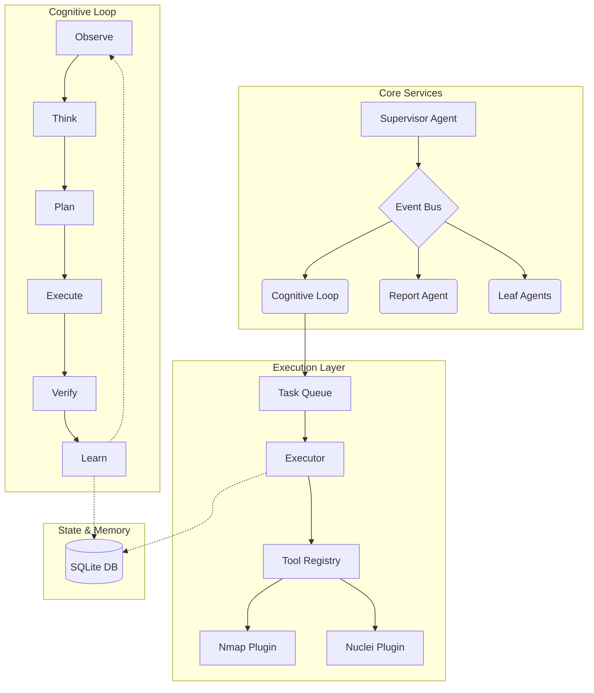

<div align="center">
  
# 🛑 HexAgent 

**Production-Grade, Autonomous Security Research Agent**

[](https://github.com/THRISHAL12345/HexAgent/actions/workflows/ci_cd.yml)
[](https://www.python.org/downloads/)
[](https://opensource.org/licenses/MIT)
[](https://flake8.pycqa.org/)

*An entirely local, goal-driven penetration testing framework designed with strict separation of cognitive concerns, event-driven architecture, and zero dependency on external APIs.*

---

[Features](#-features) •
[Architecture](#-architecture) •
[Installation](#-installation) •
[Quickstart](#-quickstart) •
[Plugin Development](#-plugin-development) •
[Documentation](#-documentation)

</div>

## ✨ Features

HexAgent is not a chatbot. It is a highly structured reasoning engine built for fully autonomous end-to-end security engagements.

- **🧠 Advanced Cognitive Loop**: Implements a strict `Observe → Think → Plan → Execute → Verify → Learn` pipeline, ensuring methodical and deliberate actions.
- **🛡️ 100% Local & Private**: Runs entirely on local infrastructure using Ollama (e.g., Qwen2.5-Coder). No data ever leaves your network.
- **🧱 Strict Separation of Concerns**: The Planner never executes tools; the Executor never makes strategic decisions. This guarantees maximum safety and testability.
- **📡 Event-Driven Architecture**: Fully decoupled internal modules communicate exclusively via a robust Pub-Sub Event Bus.
- **💾 Stateful & Resilient**: Every state transition and finding is persisted to a local SQLite database, allowing instant recovery from crashes.
- **🔌 Extensible Plugin SDK**: Easily wrap any command-line tool (Nmap, Ffuf, Nuclei, Metasploit) using the declarative `.toml` manifest system.
- **📊 Native Observability**: Out-of-the-box integration for Prometheus metrics and OpenTelemetry-style reasoning traces.

## 🏗️ Architecture

HexAgent's design completely isolates strategic reasoning from operational execution.



## 🚀 Installation

### Prerequisites
- Python 3.11+
- [Ollama](https://ollama.ai/) (Running locally with your preferred model, e.g., `qwen2.5-coder:7b-instruct`)
- Docker (optional, for isolated infrastructure deployment)

### Setup

1. **Clone the repository:**
   ```bash
   git clone https://github.com/THRISHAL12345/HexAgent.git
   cd HexAgent
   ```

2. **Install dependencies:**
   ```bash
   pip install -r requirements.txt
   ```

3. **Verify the installation (Dry Run):**
   ```bash
   python hexagent.py --engagement dry-test-01 --dry-run
   ```

## 🎯 Quickstart

To launch HexAgent against a target, you must first define the scope.

1. **Configure your scope** in `config/scope.yaml`:
   ```yaml
   engagement:
     id: "eng-2025-042"
     name: "Internal Network Audit"
     
   scope:
     include:
       - "192.168.1.0/24"
       - "test.example.com"
     exclude:
       - "192.168.1.1" # Gateway
   ```

2. **Start the engagement:**
   ```bash
   python hexagent.py --engagement eng-2025-042
   ```

3. **View the generated reports:**
   As the agent discovers assets and vulnerabilities, it will automatically generate Markdown and HTML reports in the `workspaces/eng-2025-042/` directory.

## 🧩 Plugin Development

HexAgent's Tool Abstraction Layer makes adding new capabilities trivial. To add a new tool:

1. Create a directory: `tools/plugins/mytool/`
2. Define the interface in `manifest.toml`:
   ```toml
   [tool]
   name = "mytool"
   description = "Runs my awesome security tool"
   version = "1.0.0"
   
   [execution]
   type = "subprocess"
   command_template = "mytool --target {target} -o {output_file}"
   ```
3. (Optional) Implement custom parsing logic in `plugin.py` by subclassing `Tool`.

## 📂 Project Structure

```text
HexAgent/
├── AGENTS.md               # Canonical architecture & specification
├── agents/                 # Supervisor and domain-specific agents
├── config/                 # Scope, Agent, and Secret configurations
├── core/                   # The Cognitive Loop, Event Bus, and State Machine
├── memory/                 # SQLite database and vector store logic
├── observability/          # Prometheus metrics and Tracing
├── tools/                  # Tool Registry and Plugins
├── hexagent.py             # Main execution entrypoint
└── workspaces/             # Engagement data and reports (auto-generated)
```

## 🤝 Contributing

Contributions are welcome! Please read `AGENTS.md` before submitting a Pull Request to ensure your changes align with the core architectural philosophies (especially regarding the Planner/Executor separation).

1. Fork the Project
2. Create your Feature Branch (`git checkout -b feature/AmazingFeature`)
3. Commit your Changes (`git commit -m 'Add some AmazingFeature'`)
4. Run tests and linting (`flake8 .` and `mypy .`)
5. Push to the Branch (`git push origin feature/AmazingFeature`)
6. Open a Pull Request

## 📄 License

Distributed under the MIT License. See `LICENSE` for more information.
